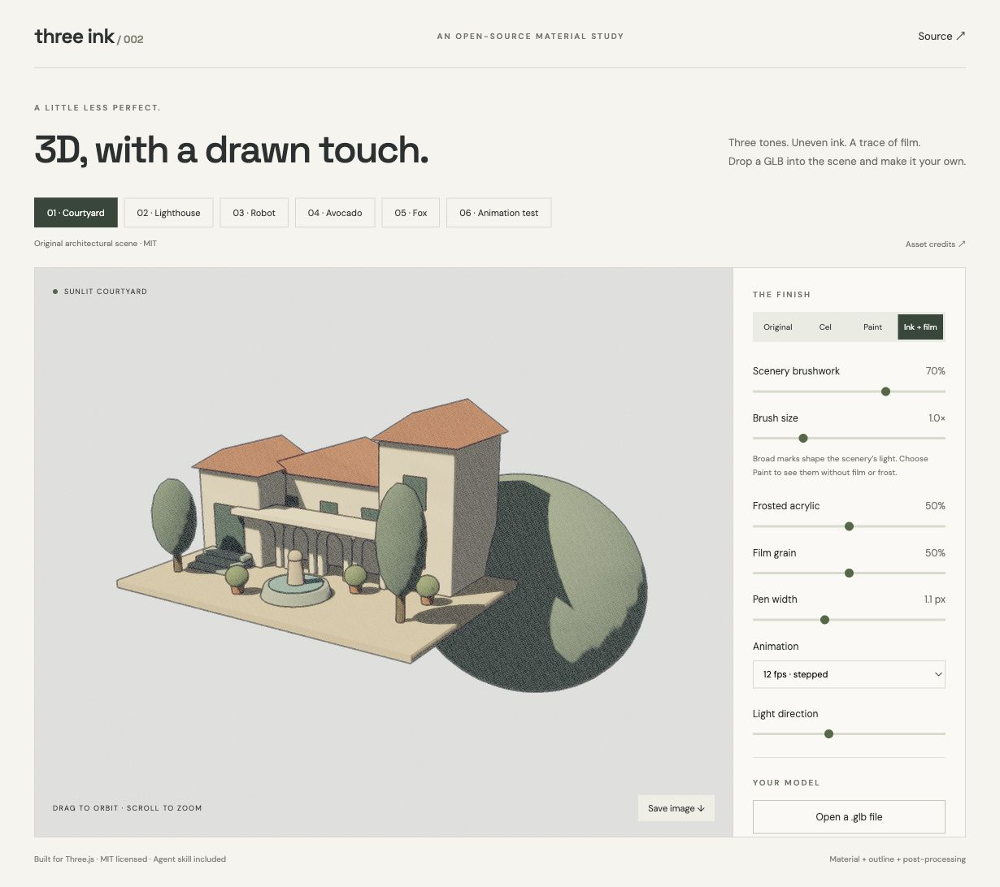

# Three Ink

Three-tone lighting, painted scenery, pen-like outlines, film grain and frosted acrylic for Three.js.

[Live playground](https://xymeow.github.io/three-ink/) · [中文说明](README.zh-CN.md) · [Agent skill](skills/three-ink/SKILL.md)

Turn standard Three.js models into an illustrated scene without rebuilding their geometry or animation. The material adapter and post-processing pass work independently: use the tones alone, the texture alone, or both.



## Run the playground

```sh
git clone https://github.com/xymeow/three-ink.git
cd three-ink
npm ci
npm run dev
```

Drop an embedded `.glb` into the viewport, switch between Original / Cel / Paint / Ink + film, and export a PNG or settings JSON. The default finish uses 50% acrylic. Six built-in examples cover a procedural courtyard, lighthouse coast, studio robot, Microsoft’s Avocado, the animated Fox and a skinning/morph fixture. The original procedural scenes are MIT licensed. Avocado is CC0; Fox combines CC0 and CC BY 4.0 assets. See [model credits](public/ATTRIBUTION.md). The viewer opens files locally and blocks external asset URLs.

## Install in your project

Requires **Three.js r186**, **WebGLRenderer** and a bundler. This version patches Three.js shader chunks, so the peer dependency stays within r186. Node 20.19+ is required for development.

```sh
npm install three@0.186.0 github:xymeow/three-ink#v0.2.0
```

The Git dependency builds the package during installation. It is not published to npm yet.

## Use

```ts
import { applyInk, InkPass, steppedTime } from "@xymeow/three-ink";
import { EffectComposer } from "three/addons/postprocessing/EffectComposer.js";
import { RenderPass } from "three/addons/postprocessing/RenderPass.js";
import { OutputPass } from "three/addons/postprocessing/OutputPass.js";

// renderer, scene, camera and model come from your existing Three.js app.
const binding = applyInk(model, {
  thresholds: [0.51, 0.785],
  shadow: "#514f73",
  mid: "#c1c4c9",
  light: "#fff5df",
});
scene.add(model);

const composer = new EffectComposer(renderer);
composer.addPass(new RenderPass(scene, camera));
const ink = new InkPass(scene, camera, {
  penWidth: 1.1,
  grain: 0.5,
  acrylic: 0.5,
  pixelRatio: renderer.getPixelRatio(),
});
composer.addPass(ink);
composer.addPass(new OutputPass());

let previous = 0;
renderer.setAnimationLoop((milliseconds) => {
  const seconds = milliseconds / 1000;
  const delta = previous ? seconds - previous : 0;
  previous = seconds;
  // If your model has an AnimationMixer:
  // mixer.setTime(steppedTime(seconds, 12));
  // Update camera controls at display refresh rate.
  composer.render(delta);
});

function resize(width: number, height: number) {
  renderer.setSize(width, height);
  composer.setSize(width, height);
  camera.aspect = width / height; // PerspectiveCamera
  camera.updateProjectionMatrix();
}

// If your app changes device pixel ratio:
function setPixelRatio(ratio: number) {
  renderer.setPixelRatio(ratio);
  composer.setPixelRatio(ratio);
  ink.configure({ pixelRatio: ratio });
}

// When removing this effect:
function disposeInk() {
  binding.dispose(); // restores original materials
  composer.removePass(ink);
  ink.dispose();
}
```

Keep your existing composer if you already have one. Place `InkPass` after the scene render and before the final `OutputPass`; don't add a second renderer or animation loop. Start with one directional light and modest ambient light. Each direct light gets a three-tone ramp; multiple lights, shadows, textures and ambient light can produce additional final colors.

## API

### `applyInk(root, options?)`

Recursively adapts supported mesh materials to `MeshToonMaterial`. Material arrays and shared materials are preserved; textures, geometry, skinning, morph targets and instance data remain owned by the app.

| Option       | Default         | Meaning                                                             |
| ------------ | --------------- | ------------------------------------------------------------------- |
| `thresholds` | `[0.51, 0.785]` | Increasing thresholds in half-Lambert space: `dot(N,L) * 0.5 + 0.5` |
| `shadow`     | `'#514f73'`     | Shadow-band light multiplier                                        |
| `mid`        | `'#c1c4c9'`     | Middle-band light multiplier                                        |
| `light`      | `'#fff5df'`     | Lit-band light multiplier                                           |

Returns a binding with `materials`, `skipped`, `setEnabled(boolean)` and `dispose()`. Inspect `skipped` to show per-object/material reasons. `setEnabled(false)` restores source material references for comparison. `dispose()` is idempotent and disposes only materials created by the binding. Later replacements made by your app are respected. Dispose before applying again to the same meshes.

The adapter snapshots material properties when called. To adopt later source-material changes, dispose and reapply. Changes to shared texture content continue to work.

### Painted scenery

Use continuous painted lighting on scenery while keeping three bands on the foreground subject. The brush atlas contains 32 sparse, wide marks. Triplanar world-space sampling varies the lighting around midtones, with no UV requirement or animated noise. It stays fixed as the camera moves. Use it for static walls, rocks, hills and ground; moving objects travel through the world-space pattern.

```ts
import { applyInk, createBrushTexture } from "@xymeow/three-ink";

const brush = createBrushTexture(); // browser canvas; caller owns texture
const binding = applyInk(model, {
  paint: {
    map: brush,
    strength: 0.7,
    scale: 0.24, // atlas repeats per world unit; lower = larger marks
    select: (mesh) => mesh.userData.inkPaint === true,
  },
});
binding.setPaint({ strength: 0.9, scale: 0.18 });
// On teardown: binding.dispose(); brush.dispose();
```

Omit `select` to paint every supported mesh in the binding. Omit `paint` to keep the original three-tone behavior. Strength `0` removes brush modulation while retaining smooth scenery lighting. The subject/scenery split works even when meshes share a source material. `setPaint` changes shared uniforms without recompiling shaders.

`createBrushTexture(seed = 517)` requires a browser canvas. In other environments, provide your own repeat-wrapped, linear grayscale texture with a neutral value of 128/255. Texture creation is never performed during module import. The binding does not dispose the supplied brush map.

In the playground, **Cel** disables brush modulation, **Paint** shows the brushwork without post-processing, and **Ink + film** adds contours, grain and frost. All three keep the selected scenery on continuous shading and subjects on three-tone lighting. Brush strength and size are independent from grain and acrylic. Example links accept `?example=courtyard`, `lighthouse`, `robot`, `avocado`, `fox` or `fixture`. Fox exposes Survey, Walk and Run individually.

### `new InkPass(scene, camera, options?)`

Uses a depth/object-ID render for contours, then a full-screen pass for ink, grain and acrylic. Supports perspective and orthographic cameras. Outlines follow object/material boundaries and depth discontinuities; they do not draw every crease on a continuous surface. Separate instances in one `InstancedMesh` share an ID, with depth edges providing separation.

| Option       | Default     | Meaning                                                             |
| ------------ | ----------- | ------------------------------------------------------------------- |
| `penWidth`   | `1.1`       | Outline sample radius in CSS pixels; `0` skips the auxiliary render |
| `penColor`   | `'#272333'` | Ink color                                                           |
| `grain`      | `0.5`       | Film grain strength, `0..1`; refreshed at 24 Hz                     |
| `acrylic`    | `0.5`       | Fixed screen-space grain, slight scatter and milky tint, `0..1`     |
| `pixelRatio` | `1`         | Match the renderer to keep pen and grain sizes stable               |

Use `configure(options)` to update the finish. Set `enabled = false` to bypass the pass. Call `reset()` after removing/replacing models to release cached ID materials. Call `dispose()` when removing the pass. A composer calls `setSize()` automatically.

The acrylic effect is a surface finish over the rendered image, rather than a glass material that refracts objects behind it. Grain is independent from lighting and does not perturb mesh geometry. The pass preserves the source alpha channel; its two-sided silhouette sampling is most predictable on an opaque scene background.

### `steppedTime(seconds, fps = 12)`

Quantizes absolute animation time. Pass `0` for smooth motion. Use it for object poses or `AnimationMixer.setTime()` while letting the renderer and camera controls run normally. It does not limit rendering FPS.

## Compatibility

| Feature                                                                   | v0.2                                                                                            |
| ------------------------------------------------------------------------- | ----------------------------------------------------------------------------------------------- |
| Standard / Physical / Phong / Lambert / Basic / Toon materials            | Converted; PBR metalness, roughness, clearcoat and environment reflections become toon lighting |
| Base color maps, vertex colors, normal/bump maps, emissive, alpha cutouts | Preserved where supported by MeshToonMaterial                                                   |
| Skinned meshes, morph targets, instanced meshes                           | Native Three.js deformation remains intact                                                      |
| Blended transparency, transmission, custom ShaderMaterial                 | Kept original and reported; omitted from the contour buffer                                     |
| Missing vertex normals                                                    | Kept original and reported                                                                      |
| Material `onBeforeCompile` customizations                                 | Not migrated; use an app-specific adapter for these                                             |
| WebGPU / TSL, logarithmic or reversed depth                               | Not supported in v0.2                                                                           |
| WebXR, stencil-mask composers, custom per-object render callbacks         | Outside the tested pipeline                                                                     |

Transparent surfaces don't occlude the contour buffer. The default pass processes the full scene. For scenes needing glass-aware contours or per-object effect masks, use a separate render layer/compositing design. Custom callbacks that mutate materials during rendering also need an application-specific integration.

The playground loads embedded GLB assets without Draco or KTX2. You can use your own fully configured GLTFLoader in an app and pass the loaded scene to `applyInk`.

## For AI agents

The repository includes a portable [Three Ink skill](skills/three-ink/SKILL.md). Copy `skills/three-ink/` into your project's `.agents/skills/three-ink/` or your agent's supported skill directory. For example, from the root of the consuming project:

```sh
mkdir -p .agents/skills
cp -R /path/to/three-ink/skills/three-ink .agents/skills/three-ink
```

Then ask: **“Use $three-ink to add three-tone shading and a 50% frosted finish to this scene. Keep the existing animation and add an original/effect toggle.”**

The skill covers integration, ownership, compatibility, color management and checks. `AGENTS.md` covers contributing to the library itself.

## Development

```sh
npm run check
npm test
npm run build:demo
node scripts/create-fixture.mjs  # regenerate the original test GLB
```

Tests cover ownership, restoration, unsupported materials, animation data, shader patch compatibility and exception-safe render-state restoration. Browser checks exercise the procedural robot and the skinned/morph GLB. The production demo is emitted to `site-dist/`, the library and declarations to `dist/`.

Inspired by our [Orbitals rendering study and experiment](https://xymeow.github.io/post/orbitals-cel-shading-experiment/). This repository contains original implementation and procedural assets, with no game assets or game source code.

Code and original scenes: MIT © 2026 xymeow. Third-party model licenses are listed in [model credits](public/ATTRIBUTION.md).
