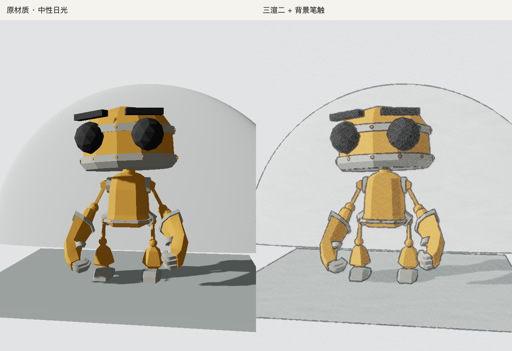

# Anime Style for Three.js

**一个让现有 Three.js 场景呈现动画画风的开源渲染库。**

角色用三段色阶，背景用宽笔触塑造明暗，再按需要叠加钢笔描边、动画阴影、胶片颗粒和磨砂。模型、贴图和动画继续使用你自己的，各层效果可以单独调整。

[**在线试玩**](https://xymeow.github.io/three-anime-style/) · [**左右对照实验室**](https://xymeow.github.io/three-anime-style/?scene=robot&palette=neutral&compare=source) · [English](README.md)



_同一个模型、视角与姿态。左侧为原材质；右侧开启三段色阶、钢笔描边、背景笔触、动画阴影，以及 50% 胶片颗粒和 50% 亚克力磨砂。_

## 这是做什么的？

这是一个面向 **Three.js r186 + WebGLRenderer** 的 TypeScript 库，附带可直接玩的网页 demo 和给 AI coding agent 使用的接入 skill。你可以把它接进已有项目，也可以先把 GLB 拖进试玩页看效果。

| 模块           | 画面会怎样变化                               |
| -------------- | -------------------------------------------- |
| 角色色阶       | 光照分为亮、中、暗三档，暗部可加少量反光     |
| 背景笔触       | 墙面、岩石和地面的明暗过渡带上固定的宽笔触   |
| 描边与动画阴影 | 钢笔风轮廓，选中角色背后可增加轻微片层偏移影 |
| 后期质感       | 胶片颗粒、亚克力磨砂各自调节                 |
| 动画节奏       | 姿态按 12 帧采样，相机与画面继续流畅刷新     |

材质和后期 pass 可以单独使用。实验室里的抽象接地影是应用层示例，可以根据自己的舞台调整。

## 先看效果

**[统一试玩页](https://xymeow.github.io/three-anime-style/)** 收录全部 13 个示例：建筑、地形、静物、动画人物和骨骼／形变测试模型。支持本地 GLB 导入、六套配色、原材质／笔触／阴影对照，以及截图和参数导出。所有模型共用相同的渲染与动画阴影控制。

旧的 `?example=fixture` 仍然打开原模型；`lab.html` 会保留场景、配色和对照参数，跳转到这一页。

本地运行需要 Node 20.19+：

```sh
git clone https://github.com/xymeow/three-anime-style.git
cd three-anime-style
npm ci
npm run dev
```

打开终端给出的 Vite 地址进入统一试玩页。导入的 GLB 在浏览器内读取；试玩页要求资源嵌入文件，不加载外部资源 URL。

## 接入已有项目

目前通过带版本号的 Git 地址安装，尚未发布到 npm：

```sh
npm install three@0.186.0 github:xymeow/three-anime-style#v0.4.1
```

安装时会构建库和 TypeScript 类型。先接入最简单的角色色阶：

```ts
import { applyInk } from "@xymeow/three-anime-style";

// model 是已有带灯光场景中的 Object3D 或 glTF scene。
const style = applyInk(model);
style.setEnabled(false); // 看原材质
style.setEnabled(true); // 恢复动画色阶
// 移除效果时：style.dispose();
```

需要描边和后期时，把 `InkPass` 加在现有 composer 的场景渲染之后、最终 `OutputPass` 之前。复用已有渲染循环即可。

[完整接入示例](docs/integration.md)包含动画采样、窗口缩放、像素比例和资源释放；[API 文档](docs/api.md)包含背景笔触、阴影、参数默认值和兼容性。

### 哪些模型适用？

支持常见不透明材质、透明裁切、骨骼动画、形变和实例模型。PBR 材质会转换成 toon 光照，贴图和几何体仍归原应用管理。

玻璃、混合透明和自定义 shader 保留原材质，原因记录在 `style.skipped`。当前使用 WebGL shader chunk 和标准深度；WebGPU 或特殊渲染管线接入前请看[兼容性表](docs/api.md#compatibility)。

## 让 agent 帮你接

把仓库中的 skill 复制到使用它的项目：

```sh
mkdir -p .agents/skills
cp -R /path/to/three-anime-style/skills/three-anime-style .agents/skills/
```

然后告诉 agent：

> 用 $three-anime-style 给这个 Three.js 场景加动画画风。保留模型和动画，复用渲染循环，加一个原图/效果切换。先做干净的三段色阶，再让背景笔触、阴影和胶片质感可调。

[Skill](skills/three-anime-style/SKILL.md)说明了接入步骤、兼容性判断和资源释放规则。支持 `SKILL.md` 的 agent 可以直接使用；其他 agent 也可以读取这份文件。要修改库本身，从 [AGENTS.md](AGENTS.md) 开始。

## 从 Three Ink 迁移

项目原名 **Three Ink**。从 v0.4.0 起，用新地址安装，把 import 中的 `@xymeow/three-ink` 改成 `@xymeow/three-anime-style`，迁移后移除旧依赖。`applyInk`、`InkPass`、`createBrushTexture`、`steppedTime` 的名称和渲染行为保持不变。替换旧 skill 文件夹后，调用名改为 `$three-anime-style`。

## 开发与来源

```sh
npm run check
npm test
npm run build:demo
npm run format:check
```

库输出到 `dist/`，统一试玩页输出到 `site-dist/`。修改描边或阴影遮罩后，在 Vite 下打开 `/tests/gpu.html` 检查真实 WebGL 渲染。原创动画测试模型可通过 `node scripts/create-fixture.mjs` 重新生成。

项目来自[我们的 Orbitals 技术调研与小实验](https://xymeow.github.io/post/orbitals-cel-shading-experiment/)。代码和原创场景使用 MIT 许可证；外部模型按各自许可证提供，详见[试玩模型署名](public/ATTRIBUTION.md)与[实验室模型署名](public/lab-models/CREDITS.md)。
